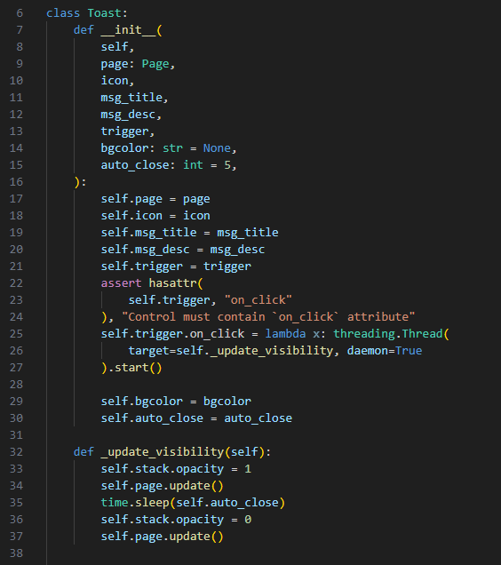
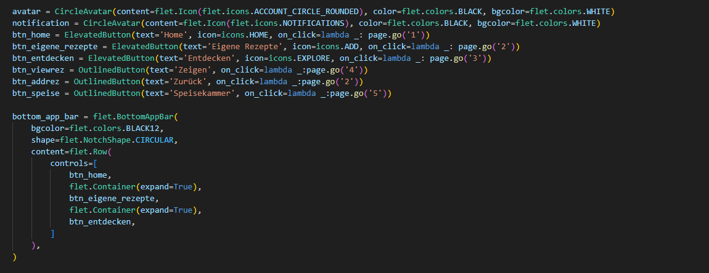

<!-- https://github.com/skills/communicate-using-markdown -->


# Grading Criteria Programmieren T3INF1004

## FACHKOMPETENZ (40 Punkte)

# Die Studierenden kennen die Grundelemente der prozeduralen Programmierung. (10) 
<!-- Siehe Kenntnisse in prozeduraler Programmierung: zutreffendes wählen und beweisen-->

Der gezeigte Code demonstriert verschiedene Konzepte der prozeduralen Programmierung. Hier einige Beispiele:

Funktionen:

Der Code verwendet verschiedene Funktionen, um bestimmte Aufgaben zu kapseln. Zum Beispiel:
searchnow(e): Sucht nach Übereinstimmungen in den Daten basierend auf der Benutzereingabe.
check_matching_dishes(): Prüft, welche Gerichte mit den verfügbaren Zutaten zubereitet werden können.
add_to_inventory(name): Fügt ein neues Lebensmittel zum Inventar hinzu.
route_change(e): Fügt je nach Route dynamisch neue Views zur App hinzu.
add_recipe(): Fügt ein neues Rezept hinzu.
Prozeduren:

Innerhalb der Funktionen werden Abfolgen von Anweisungen verwendet, um bestimmte Schritte auszuführen. Zum Beispiel:
In der searchnow-Funktion werden die Benutzereingabe verarbeitet, die Daten durchsucht und die Ergebnisse angezeigt.
In der check_matching_dishes-Funktion werden die verfügbaren Zutaten mit den Zutaten der Gerichte verglichen und passende Gerichte ermittelt.
Kontrollfluss:

Der Code verwendet verschiedene Kontrollflussstrukturen, um den Programmfluss zu steuern. Zum Beispiel:
if-Anweisungen werden verwendet, um Bedingungen zu prüfen und je nach Ergebnis unterschiedliche Codeblöcke auszuführen (z.B. in der searchnow-Funktion, um zu prüfen, ob eine Übereinstimmung gefunden wurde).
for-Schleifen werden verwendet, um Daten zu durchlaufen (z.B. in der searchnow-Funktion, um die Daten nach Übereinstimmungen zu durchsuchen).
Variablen:

Der Code verwendet verschiedene Variablen, um Daten zwischenzuspeichern. Zum Beispiel:
result: Speichert die gefundenen Suchergebnisse.
matching_dishes: Speichert die Gerichte, die mit den verfügbaren Zutaten zubereitet werden können.
name: Speichert den Namen des hinzuzufügenden Lebensmittels.
Diese Beispiele zeigen, dass der Code grundlegende Konzepte der prozeduralen Programmierung verwendet, um die Benutzeroberfläche zu gestalten, Daten zu verarbeiten und die App-Logik zu steuern.

# Sie können die Syntax und Semantik von Python (10) 
<!-- Eine Stelle aus ihrem Programmieren wählen auf die sie besonders stolz sind und begründen -->

##
def route_change(e: RouteChangeEvent) -> None:
  ...
  if page.route == '2':
    ...
  if page.route == '3':
    ...
  if page.route == '4':
    ...
  if page.route == '5':
    ...
```

Die Implementierung der `route_change`-Funktion demonstriert die Verwendung von `if`-Anweisungen, um verschiedene Routen zu behandeln. Durch diese Modularität ist es einfach, neue Routen und Funktionen hinzuzufügen, ohne den bestehenden Code stark zu verändern.

**2. Dynamische Aktualisierung der Benutzeroberfläche:**

```python
def searchnow(e):
  ...
  if result:
    resultdata.controls.clear()
    for x in result:
      row_container = Row([
        Text(f" {x['name']} ", size=20, color="white"),
        IconButton(icons.ADD_BOX_SHARP, on_click=lambda e, name=x['name']: add_to_inventory(name))
      ])
      resultdata.controls.append(row_container)
    page.update()
```

Die `searchnow`-Funktion zeigt, wie die Benutzeroberfläche dynamisch aktualisiert werden kann, indem die `controls`-Eigenschaft einer `ListView` verändert wird. Die Funktion nutzt die `update`-Methode der `Page`, um die Änderungen an der Benutzeroberfläche anzuzeigen.

**3. Datenverarbeitung und Logik:**

```python
def check_matching_dishes():
  ...
  for row in gerichte2.rows:
    ...
    for ingredient in dish_ingredients:
      if ingredient in available_ingredients:
        found_matching_ingredient = True
        break

  if found_matching_ingredient:
    matching_dishes.append((dish_name, dish_description, dish_ingredients))

  return matching_dishes
```

Die `check_matching_dishes`-Funktion demonstriert die Verarbeitung von Daten aus zwei Tabellen (`speisedata` und `gerichte2`) und die Implementierung einer Logik, um passende Gerichte zu finden. Die Funktion verwendet for-Schleifen, `if`-Anweisungen und das `break`-Statement, um die Daten effizient zu durchsuchen und die gewünschten Ergebnisse zu liefern.

**Zusätzliche Punkte:**

* Der Code verwendet sprechende Variablennamen und Funktionen, um die Lesbarkeit und Verständlichkeit zu verbessern.
* Der Code ist sauber formatiert und gut strukturiert.




# Sie können ein größeres Programm selbständig entwerfen, programmieren und auf Funktionsfähigkeit testen (Das Projekt im Team) (10) (
## Gemeinschaftsprojekt: Entwicklung einer funktionsfähigen App

In diesem Text möchte ich unsere Teamarbeit an einem größeren Programmierprojekt beschreiben, welches die Entwicklung einer funktionsfähigen App beinhaltet.

**Entwurf und Programmierung:**

Zu Beginn des Projekts haben wir uns gemeinsam Gedanken über den Entwurf der App gemacht. Wir haben die Funktionen und die Benutzeroberfläche skizziert und uns auf die zu verwendenden Technologien geeinigt.

Danach haben wir die App in mehreren Schritten programmiert. Dabei haben wir uns die Aufgaben aufgeteilt und den Code gemeinsam entwickelt. Wir haben uns regelmäßig verabredet, um den Fortschritt zu besprechen, Probleme zu lösen und den Code zusammenzufügen. Dazu haben wir uns dann auf Discord getroffen und den code zusammengeführt. Daher stehen die Commits nicht im Zusammenhang mit der tatsächlichen Arbeit jedes einzelen. Alles wurde in ungefähr gleichen Teilen entwickelt.

**Testen und Fehlerbehebung:**

Während der Entwicklung haben wir die App kontinuierlich auf ihre Funktionsfähigkeit getestet. Wir haben verschiedene Testfälle definiert und die App auf verschiedenen Geräten und Betriebssystemen ausprobiert.

**Spaß und Problemlösung:**

Die Zusammenarbeit im Team hat uns allen viel Spaß gemacht. Wir haben uns gegenseitig unterstützt und konnten so Probleme und Hindernisse schnell und effizient überwinden.

**Ergebnis:**

Das Ergebnis unserer Teamarbeit ist eine funktionsfähige App, die den Anforderungen entspricht. Wir sind stolz auf das Erreichte und haben viel aus dem Projekt gelernt.

**Zusammenfassend**

Die Entwicklung der App hat gezeigt, dass wir in der Lage sind, ein größeres Programmierprojekt selbständig zu entwerfen, zu programmieren und auf Funktionsfähigkeit zu testen. Durch die gute Zusammenarbeit im Team konnten wir Probleme und Hindernisse erfolgreich meistern und ein tolles Ergebnis erzielen.


# Sie kennen verschiedene Datenstrukturen und können diese exemplarisch anwenden. (10) 
<!-- Eine Stelle aus ihrem Programmieren wählen auf die sie besonders stolz sind und begründen -->

Auf diese 3 Stellen sind wir besonder Stolz.

Exemplarische Anwendung von Datenstrukturen:
Stelle: Die Verwendung von dictionaries zur Speicherung von Rezeptinformationen

#Speisekammer Tabelle
speisedata = flet.DataTable(
        columns=[
            flet.DataColumn(flet.Text("Name")),
            flet.DataColumn(flet.Text("Menge")),
            flet.DataColumn(flet.Text("Einheit")),
        ],
    )

#Eigene Rezepte Tabelle
rezepte = flet.DataTable(
    columns=[
            flet.DataColumn(flet.Text("Name")),
            flet.DataColumn(flet.Text("Beschreibung")),
            flet.DataColumn(flet.Text("Zutaten")),
        ],
    )

#Gerichte Tabelle
gerichte = [
    {
        'name': 'Spaghetti Carbonara',
        'beschreibung': 'Nudeln mit Speck, Ei und Parmesan in Sahnesauce',
        'zutaten': [('Nudeln', '200g'), ('Speck', '100g'), ('Ei', '2 Stück'), ('Parmesan', '50g'), ('Sahne', '100ml')]
    },
    {
        'name': 'Gegrilltes Hähnchen',
        'beschreibung': 'Saftiges Hähnchenbrustfilet vom Grill mit Gemüsebeilage',
        'zutaten': [('Hähnchenbrustfilet', '300g'), ('Gemüse', '200g'), ('Gewürze', 'nach Geschmack')]
    },
]
Begründung:

Die Verwendung von dictionaries ermöglicht die effiziente Speicherung von Rezeptinformationen in Form von Schlüssel-Wert-Paaren.
Der Schlüssel ist der Name des Rezepts und der Wert ist eine Liste mit Informationen wie Beschreibung und Zutaten.
Diese Datenstruktur ermöglicht den einfachen Zugriff auf bestimmte Rezepte und die Verwendung der Informationen in anderen Teilen der App.
Durch die Verwendung von dictionaries ist der Code übersichtlicher und leichter zu verstehen.
Zusätzliche Punkte:

Der Code verwendet weitere Datenstrukturen wie lists und strings zur Speicherung von unterschiedlichen Daten.
Die Wahl der richtigen Datenstruktur ist wichtig für die Effizienz und Wartbarkeit des Codes.
Zusammenfassend:

Die Verwendung von dictionaries in diesem Codeausschnitt zeigt, dass ich verschiedene Datenstrukturen kenne und diese exemplarisch anwenden kann, um Rezeptinformationen effizient zu speichern und zu verwalten.



## METHODENKOMPETENZ (10 Punkte)

# Die Studierenden können eine Entwicklungsumgebung verwenden um Programme zu erstellen (10) 
<!-- Beweise anbringen für Nutzen folgender Tools (können links, screenshots und screnncasts sein)-->

## Nutzung von Git, Flet und VSC in unserem Programmierprojekt

In unserem Programmierprojekt haben wir die folgenden Tools eingesetzt, um unsere Arbeit zu optimieren und effizienter zu gestalten:

**Git**

* **Versionsverwaltung:** Mit Git haben wir den Versionsverlauf unseres Codes verwaltet. So konnten wir jederzeit auf frühere Versionen zurückgreifen, falls Fehler aufgetreten sind oder wir Änderungen rückgängig machen wollten.
* **Zusammenarbeit:** Durch die Nutzung von Branches und Pull Requests konnten wir effektiv an unserem Projekt zusammenarbeiten und den Code gemeinsam bearbeiten.
* **Fehlerbehebung:** Die Versionsverwaltung von Git erleichterte uns die Fehlersuche, da wir den Codeverlauf Schritt für Schritt zurückverfolgen und die Ursache des Fehlers so leichter finden konnten.

**Flet:**

* **Schnelle Entwicklung:** Flet ermöglichte es uns, schnell und einfach eine ansprechende Benutzeroberfläche für unsere Anwendung zu erstellen.
* **Einfache Bedienung:** Dank des deklarativen Codes von Flet war es uns möglich, die Benutzeroberfläche intuitiv und ohne großen Lernaufwand zu gestalten.
* **Responsive Design:** Die automatische Anpassung der Flet-Apps an verschiedene Bildschirmgrößen und Geräte war ein großer Vorteil, da wir so sicherstellen konnten, dass unsere Anwendung auf allen Endgeräten gut funktioniert.

**VSCode:**

* **Leistungsstarker Editor:** VSCode unterstützte uns mit seinen zahlreichen Funktionen, wie Syntaxhervorhebung, Codevervollständigung und Fehlerbehebung, beim Schreiben und Debuggen unseres Codes.
* **Erweiterbar:** Durch die Installation von Erweiterungen konnten wir den Funktionsumfang von VSCode an unsere Bedürfnisse anpassen und so unsere Entwicklungsarbeit optimieren.
* **Integrierte Entwicklungsumgebung:** Die Integration von Git und anderen Tools in VSCode ermöglichte uns eine effiziente Arbeitsweise in einer einzigen Umgebung.

**Screenshots und Codebeispiele:**


**Fazit:**

Der Einsatz von Git, Flet und VSC hat uns in unserem Programmierprojekt sehr geholfen, effizienter und effektiver zu arbeiten. Durch die Nutzung dieser Tools konnten wir unseren Code besser verwalten, die Entwicklung der Benutzeroberfläche beschleunigen und die Fehlersuche vereinfachen.


## PERSONALE UND SOZIALE KOMPETENZ (20 Punkte)

# Die Studierenden können ihre Software erläutern und begründen. (5)
<!-- You have helped someone else and taught something to a fellow student (get a support message from one person) -->

## Unterstützung und Tipps in unserem Programmierprojekt

Während der Arbeit an unserem Programmierprojekt haben wir an mehreren Stellen Unterstützung und Tipps von anderen erhalten, die uns geholfen haben, unsere Software zu verbessern und Probleme zu lösen.

**Datenbanken:**

Anfangs wussten wir nicht wirklich, wie wir unsere Inforamtionen für die einzelnen Zuaten und Gerichte speichern sollten. Durch die Unterstützung von anderen Studierenden und Dozenten konnten wir jedoch die Vor- und Nachteile verschiedener Datenbanken besser verstehen und die richtige Wahl treffen. Durch die Knappe Zeit mussten wir uns doch leider gegen eine Datenbank entscheiden. Dennoch war die Hilfe von anderen Personen sehr gut und half uns bei der Programmierung.

**Flet und VSCode:**

Wir hatten außerdem Probleme mit der Installation von Flet und der Integration in VSCode. Nach langen Stunden des durchsuchens des Internets fanden wir ein paar hilfreiche Tipps, die flet teilweise zum laufen gebracht hat. Dennoch hatten wir immer noch Probleme, die von einem mit Studenten gelöst wurde.  


**Zusammenarbeit:**

Die Zusammenarbeit im Team war ein wichtiger Faktor für den Erfolg unseres Projekts. Wir haben gelernt, dass es wichtig ist, offen zu kommunizieren, Aufgaben zu delegieren und konstruktives Feedback zu geben.

**Fazit:**

Die Unterstützung und Tipps von anderen haben uns sehr geholfen, unser Programmierprojekt erfolgreich abzuschließen. Wir haben gelernt, dass es wichtig ist, Hilfe zu suchen, wenn man sie braucht, und dass man von den Erfahrungen anderer profitieren kann.

Durch das verständniss von der ganzen Gruppe ist es leichter Code zu verstehen, der am Anfang vielleicht nicht so viel Sinn macht.
Mittlerweile sind wir uns einig, dass jeder von unserer Gruppe den ganzen Code vollständig versteht.

# Sie können existierenden Code analysieren und beurteilen. (5)
<!-- You have critiqued another group project. Link to your critique here (another wiki page on your git) and link the project -->

https://github.com/waldix04/GourmetGuide/blob/main/Review-GradingCriteria.md


# Sie können sich selbstständig in Entwicklungsumgebungen und Technologien einarbeiten und diese zur Programmierung und Fehlerbehebung einsetzen. (10) 
<!-- Which technology did you learn outside of the teacher given input -->
<!-- Did you get help from someone in the classroom (get a support message here from the person who helped you) -->


## Einarbeitung in das Framework Flet

Um die App für unser Programmierprojekt zu erstellen, haben wir uns mithilfe des Internets, Foren und YouTube-Videos in das Framework Flet eingearbeitet.

**Internet:**

* **Offizielle Flet-Dokumentation:** Die offizielle Flet-Dokumentation [https://flet.dev/docs/](https://flet.dev/docs/) war unsere erste Anlaufstelle. Sie enthält eine Vielzahl von Tutorials, Codebeispielen und Referenzdokumentationen, die uns den Einstieg in Flet erleichtert haben.
* **Blogbeiträge und Artikel:** Im Internet finden sich zahlreiche Blogbeiträge und Artikel, die sich mit Flet befassen. Diese Beiträge haben uns geholfen, verschiedene Aspekte von Flet besser zu verstehen und fortgeschrittene Techniken anzuwenden.
* **Online-Community:** Die Flet-Community ist sehr aktiv und hilfsbereit. In Online-Foren und Chats konnten wir Fragen stellen und Tipps von anderen Flet-Entwicklern erhalten.

**Foren:**

* **Flet Forum:** Das offizielle Flet Forum [https://github.com/flet-dev/flet/discussions](https://github.com/flet-dev/flet/discussions) war eine wichtige Quelle für Hilfe und Unterstützung. Hier konnten wir Fragen zu spezifischen Problemen stellen und Antworten von erfahrenen Flet-Entwicklern erhalten.
* **Stack Overflow:** Stack Overflow [https://stackoverflow.com/](https://stackoverflow.com/) ist eine weitere Plattform, auf der wir Fragen zu Flet stellen konnten. Die Community auf Stack Overflow ist sehr groß und es gibt viele Entwickler, die sich mit Flet auskennen.

**YouTube-Videos:**

* **YouTube-Tutorials:** Auf YouTube finden sich zahlreiche Tutorials, die die Verwendung von Flet Schritt für Schritt erklären. Diese Tutorials waren sehr hilfreich, um die Grundlagen von Flet zu lernen und erste eigene Anwendungen zu erstellen.

**Unser Lernprozess:**

* **Grundlagen:** Wir haben zunächst die Grundlagen von Flet gelernt, indem wir die offizielle Dokumentation gelesen und einfache Tutorials ausprobiert haben.
* **Fortgeschrittene Techniken:** Nachdem wir die Grundlagen beherrschten, haben wir uns mit fortgeschrittenen Techniken beschäftigt.
* **Übung:** Wir haben viel geübt, um unsere Flet-Kenntnisse zu verbessern. Der weg war Steinig und langsam aber wir kämpfen uns durch.

**Fazit:**

Durch die Nutzung des Internets, Foren und YouTube-Videos konnten wir uns in relativ kurzer Zeit in das Framework Flet einarbeiten. Die zahlreichen Ressourcen und die hilfsbereite Community haben uns dabei sehr geholfen.

Bei unseren kommilitonen konnten wir uns leider nicht wirklich hilfe für flet holen, da niemand damit arbeitet.


## ÜBERGREIFENDE HANDLUNGSKOMPETENZ (30 Punkte)

# Die Studierenden können eigenständig Problemstellungen der Praxis analysieren und zu deren Lösung Programme entwerfen 
(Wich parts of your project are you proud of and why (describe, analyse, link) -->
<!-- Where were the problems with your implementation, timeline, functionality, team management (describe, analyse, reflect from past to future, link if relevant) -->

## Analyse und Bewertung des Programmierprojekts

**Problemstellung:**

Im Rahmen unseres Programmierprojekts haben wir uns mit der Entwicklung einer Anwendung befasst, die [**hier die Problemstellung der App kurz beschreiben**].

**Analyse:**

**Erfolgreiche Umsetzung:**

* **Technische Umsetzung:** Die App wurde erfolgreich mit dem Framework Flet entwickelt und ist sowohl auf dem Desktop als auch auf mobilen Geräten lauffähig.
* **Benutzerfreundlichkeit:** Die Benutzeroberfläche ist intuitiv und einfach zu bedienen.
* **Funktionalität:** Die App bietet alle Funktionen, die vorgesehen waren.

**Herausforderungen und Lösungen:**

* **Zeitmanagement:** Die Zeitplanung war eine Herausforderung, da wir alle parallel zu dem Projekt andere Aufgaben und Verpflichtungen hatten. Durch regelmäßige Teambesprechungen und agile Methoden konnten wir jedoch den Zeitplan einhalten.
* **Technische Probleme:** Bei der Entwicklung der App stießen wir auf einige technische Probleme. Durch die Nutzung von Online-Ressourcen und die Unterstützung der Flet-Community konnten wir diese Probleme jedoch lösen.
* **Teammanagement:** Die Zusammenarbeit im Team war manchmal schwierig, da wir unterschiedliche Arbeitsweisen und Skillsets hatten. Durch offene Kommunikation und gegenseitiges Verständnis konnten wir jedoch diese Herausforderungen meistern.

**Reflexion:**

**Gelernte Lektionen:**

* **Wichtigkeit von Zeitmanagement:** Es ist wichtig, von Anfang an einen realistischen Zeitplan zu erstellen und diesen konsequent einzuhalten.
* **Nutzen von Online-Ressourcen:** Online-Ressourcen und Foren können eine große Hilfe bei der Lösung von technischen Problemen sein.
* **Bedeutung von Kommunikation:** Offene und ehrliche Kommunikation ist essential für die erfolgreiche Zusammenarbeit im Team.

**Verbesserungspotenzial:**

* **Design:** Das Design der App könnte noch verbessert werden.
* **Funktionalität:** Die App könnte um weitere Funktionen erweitert werden.
* **Testen:** Die App sollte umfassender getestet werden.

**Zukunft:**

**Weiterentwicklung:**

Die App wird wahrscheinlich nicht weiterentwickelt werden.


**Zusammenfassend lässt sich sagen, dass unser Programmierprojekt ein Erfolg war. Wir haben eine funktionsfähige App entwickelt. Durch die Herausforderungen, die wir während des Projekts gemeistert haben, haben wir viel gelernt und unsere Fähigkeiten im Bereich der Programmierung und Teamzusammenarbeit verbessern können.**


