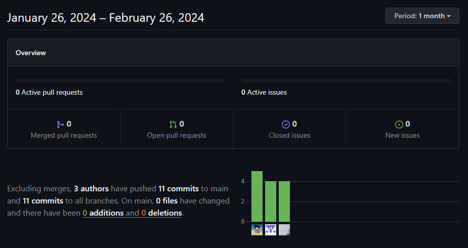
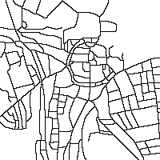
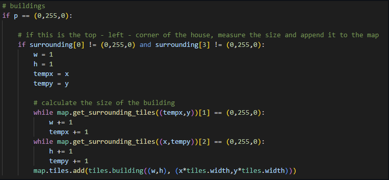
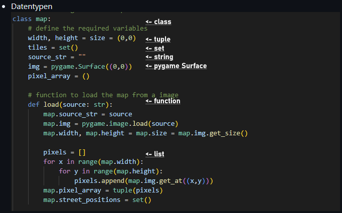
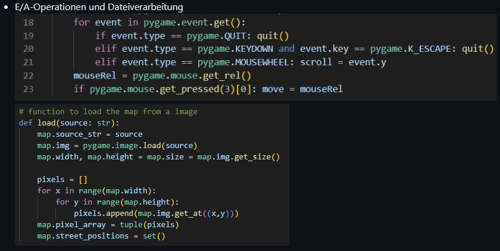
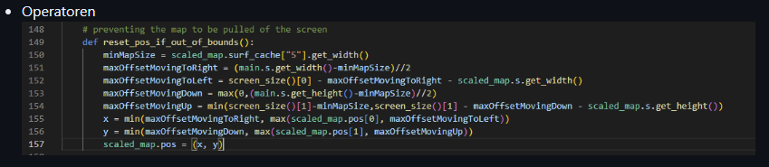
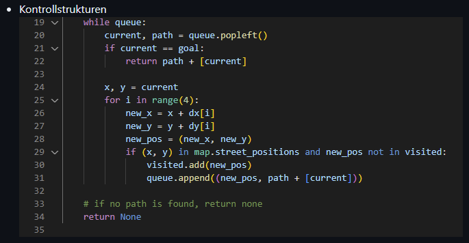
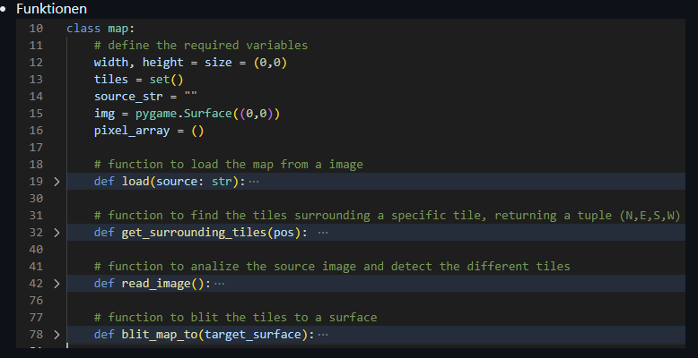
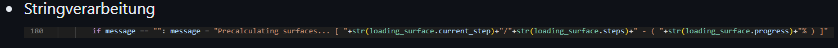
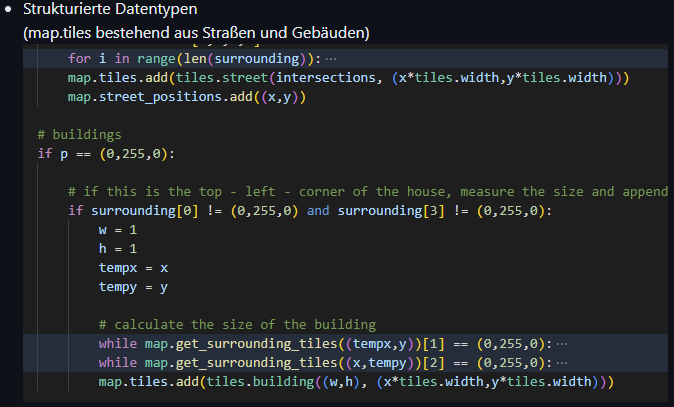

<!-- https://github.com/skills/communicate-using-markdown -->

##Bewertung von Gruppe 6: Straßenverkehrssimulation

# Grading Criteria Programmieren T3INF1004
In jedem Unterbereich werden die Punkte (gerne auch Links ins GIT) erklärt, wie das LO erreicht worden ist.

## FACHKOMPETENZ (40 Punkte)

# Die Studierenden kennen die Grundelemente der prozeduralen Programmierung. (10)
<!-- Siehe Kenntnisse in prozeduraler Programmierung: zutreffendes wählen und beweisen-->

Siehe letzten Abschnitt

# Sie können die Syntax und Semantik von Python (10)
<!-- Eine Stelle aus ihrem Programmieren wählen auf die sie besonders stolz sind und begründen -->

 Besonders Stolz sind wir auf das kartenmanagment. Das Bad Mergentheim hier benutzt wurde um die Simulation durchzuführen. Das hat was mit benutzerfreundlichkeit jetzt in diesem Zusammenhang zu tun. Da wir in Bad mergentheim studieren und dieses projekt als test fungiert. 

# Sie können ein größeres Programm selbständig entwerfen, programmieren und auf Funktionsfähigkeit testen (Das Projekt im Team) (10) (10 Punkte)
<!-- Anhand von commits zeigen, wie sie im Projekt einen Beitrag geleistet haben-->

Hier sieht man das jeder was beigetragen hat

# Sie kennen verschiedene Datenstrukturen und können diese exemplarisch anwenden. (10) (10)
<!-- Eine Stelle aus ihrem Programmieren wählen auf die sie besonders stolz sind und begründen -->

Besonders Stolz sind wir auf das kartenmanagment. Das bad Mergentheim hier benutzt wurde um die Simulation durchzuführen. 

## METHODENKOMPETENZ (10 Punkte) (10 Punkte)

# Die Studierenden können eine Entwicklungsumgebung verwenden um Programme zu erstellen (10)
<!-- Beweise anbringen für Nutzen folgender Tools (können links, screenshots und screnncasts sein)-->

https://github.com/QuantumVortex1/Street-Simulation/blob/main/grading.md#14-sie-kennen-verschiedene-datenstrukturen-und-k%C3%B6nnen-diese-exemplarisch-anwenden

1. GIT 
2. VSC
3. Discord
4. Pygame

## PERSONALE UND SOZIALE KOMPETENZ (20 Punkte)

# Die Studierenden können ihre Software erläutern und begründen. (5)
<!-- You have helped someone else and taught something to a fellow student (get a support message from one person) -->

Anhand der Presäntation und der Readme.datei kann man sehen das dieses Team zusammen gearbeitet hat. 

# Sie können existierenden Code analysieren und beurteilen. (5)
<!-- You have critiqued another group project. Link to your critique here (another wiki page on your git) and link the project -->

Können wir nicht beurteilen 

# Sie können sich selbstständig in Entwicklungsumgebungen und Technologien einarbeiten und diese zur Programmierung und Fehlerbehebung einsetzen. (10)
<!-- Which technology did you learn outside of the teacher given input -->
<!-- Did you get help from someone in the classroom (get a support message here from the person who helped you) -->

Vom Unterricht fremde technologie war zum Beispiel hier Pygame. Auch damit ist das Team gut zurechtgekommen.

## ÜBERGREIFENDE HANDLUNGSKOMPETENZ (30 Punkte)

# Die Studierenden können eigenständig Problemstellungen der Praxis analysieren und zu deren Lösung Programme entwerfen (30)
<!-- Which parts of your project are you proud of and why (describe, analyse, link) -->
<!-- Where were the problems with your implementation, timeline, functionality, team management (describe, analyse, reflect from past to future, link if relevant) -->

## Kenntnisse in prozeduraler Programmierung:

# - Algorithmenbeschreibung

# - Datentypen

# - E/A-Operationen und Dateiverarbeitung

# - Operatoren

# - Kontrollstrukturen

# - Funktionen

# - Stringverarbeitung

# - Strukturierte Datentypen

